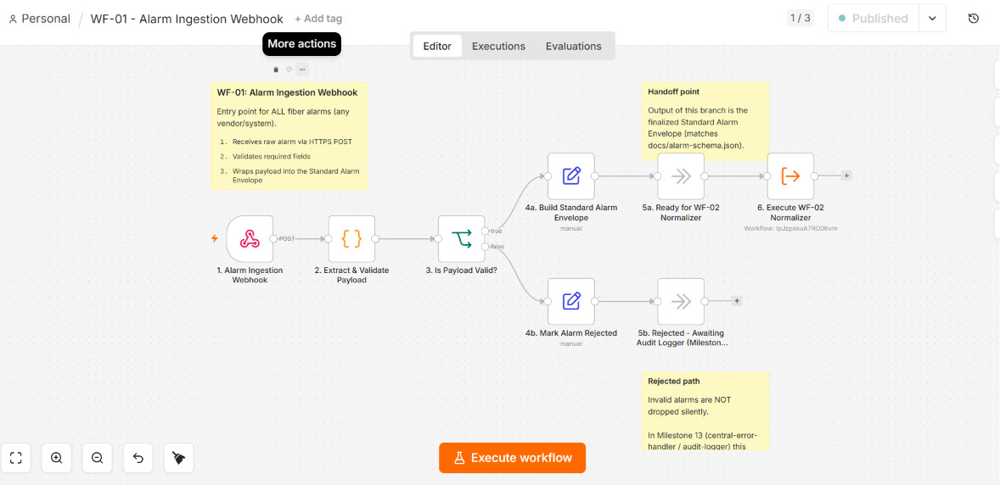
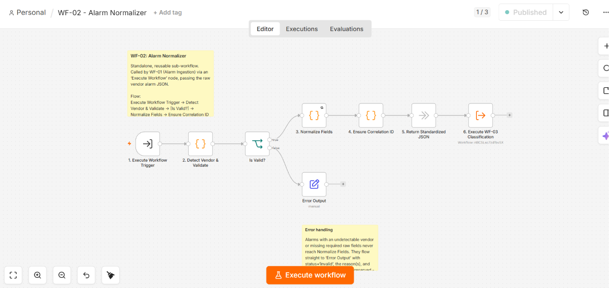
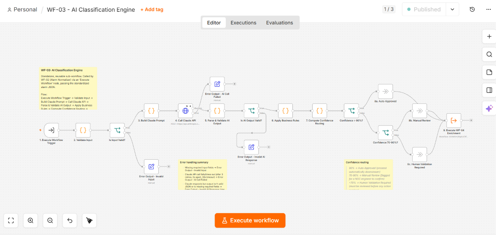
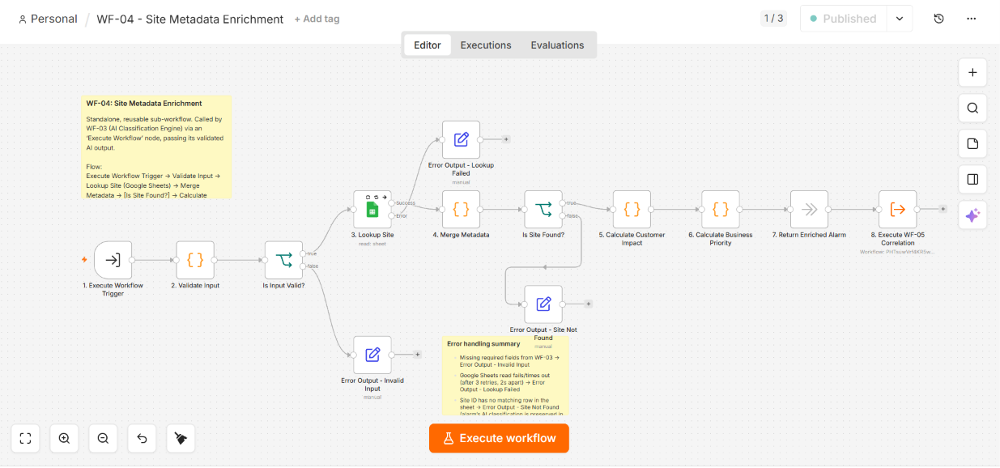
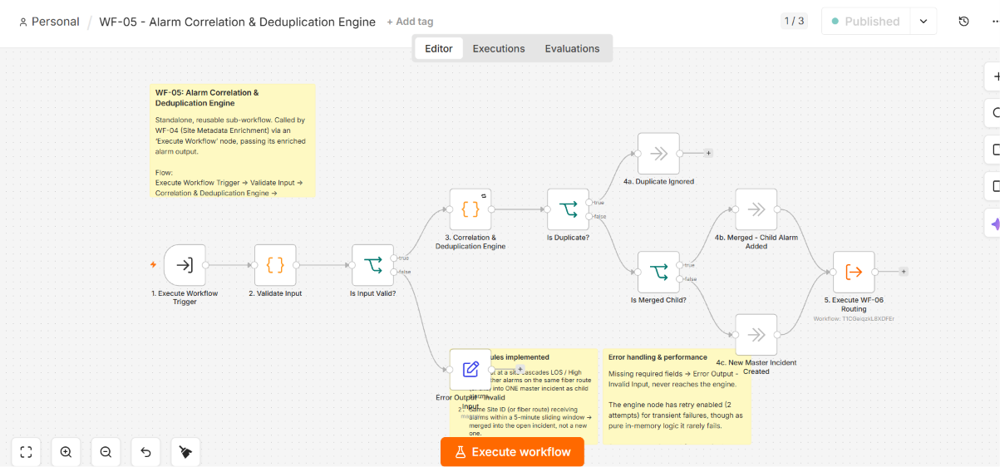
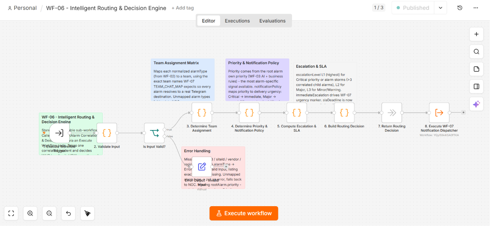
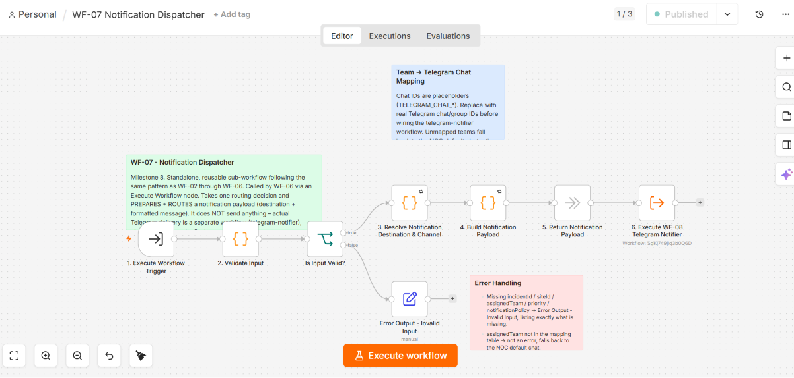
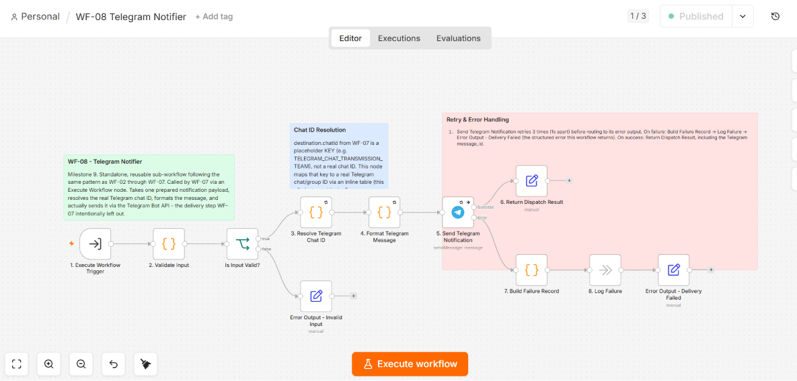
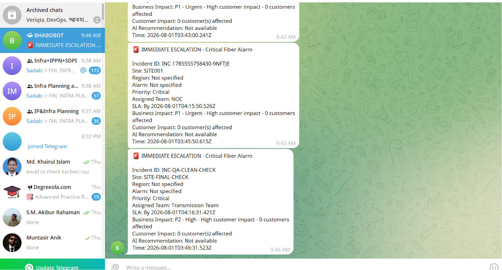

# AI Fiber Alarm Automation

[](LICENSE)
[](https://n8n.io)
[](https://www.anthropic.com)

An end-to-end fiber-network alarm automation pipeline built on **n8n**. Raw alarms from five vendor NMS/EMS systems are ingested, normalized into one standard schema, classified by Claude (Anthropic), enriched with site metadata from Google Sheets, correlated/deduplicated, routed by business rules, and dispatched to the responsible team on Telegram.

The pipeline is implemented as **8 independent, chained n8n sub-workflows** (`WF-01` → `WF-08`), each single-responsibility, each wired to the next via an `Execute Workflow` node.

---

## Pipeline overview

```
Alarm Source (Huawei / Nokia / Cisco / Juniper / FiberHome)
      │  POST /fiber-alarm-ingest
      ▼
WF-01  Alarm Ingestion Webhook        — public HTTP entry point
      ▼
WF-02  Alarm Normalizer               — vendor detection + field mapping
      ▼
WF-03  AI Classification Engine       — Claude-based severity/root-cause analysis
      ▼
WF-04  Site Metadata Enrichment       — Google Sheets lookup + impact scoring
      ▼
WF-05  Alarm Correlation & Dedup      — groups related alarms into one incident
      ▼
WF-06  Intelligent Routing & Decision — team assignment, priority, SLA, escalation
      ▼
WF-07  Notification Dispatcher        — builds the Telegram payload
      ▼
WF-08  Telegram Notifier               — sends the message via Telegram Bot API
```

Every stage after WF-01 is invoked exclusively via n8n's `Execute Workflow Trigger` — none of them expose a public endpoint. Full per-workflow detail (nodes, validation rules, schemas, error paths) is in [docs/WORKFLOW.md](docs/WORKFLOW.md).

---

## Features

- **Multi-vendor ingestion** — Huawei-U2000, Nokia-NFM-P, Cisco-EPNM, Juniper-JunosSpace, FiberHome-iManagerU31, each with its own field mapping and required-field validation.
- **Standard alarm schema** — every vendor payload is normalized into 12 standard alarm types (`FIBER_CUT`, `LOS`, `LOF`, `HIGH_BER`, `HIGH_ATTENUATION`, `OTN_PORT_DOWN`, `DWDM_CARD_FAILURE`, `MUX_FAILURE`, `POWER_FAILURE`, `SITE_DOWN`, `LINK_DOWN`, `TEMPERATURE_ALARM`) or `OTHER`.
- **AI classification with deterministic guardrails** — Claude assesses root cause, impact, priority, and recommended action; five alarm types have hard-coded business-rule overrides that Claude cannot contradict.
- **Confidence-based review routing** — >90% confidence auto-approves, 70–90% routes to manual review, <70% requires human validation.
- **Site enrichment** — looks up each alarm's site in a Google Sheet for customer count, SLA tier, coordinates, and engineer contacts; computes a blended customer-impact and a weighted business-priority score (P1–P4).
- **Correlation & deduplication** — groups alarms by fiber route (or site) within a 5-minute window into one master incident, with exact-duplicate detection and 24-hour retention pruning.
- **Rule-based routing** — assigns the responsible team, priority, notification policy, escalation level, and SLA deadline per alarm type and incident context.
- **Telegram delivery** — formats and sends the final notification via the Telegram Bot API, with retry and a structured failure record on delivery failure.

## System Architecture


The diagram below illustrates the complete end-to-end AI Fiber Alarm Automation workflow, including vendor alarm ingestion, AI-based classification, metadata enrichment, business rule processing, and Telegram notification delivery.

## Known current limitations

- WF-01's public webhook currently has **no authentication configured**.
- WF-08's per-team chat-ID table currently routes every team to the same Telegram chat.
- The correlation/dedup store (WF-05) is in-memory (`n8n` workflow static data) — single-instance only.

See [SECURITY.md](SECURITY.md) and [docs/TROUBLESHOOTING.md](docs/TROUBLESHOOTING.md) for details and mitigation.

---

## Documentation

| Doc | Purpose |
|---|---|
| [docs/INSTALLATION.md](docs/INSTALLATION.md) | Credentials, Google Sheet setup, importing and activating the 8 workflows |
| [docs/ARCHITECTURE.md](docs/ARCHITECTURE.md) | Full pipeline architecture, business-rule engines, data flow |
| [docs/API.md](docs/API.md) | The public webhook contract and every internal Execute-Workflow input/output schema |
| [docs/WORKFLOW.md](docs/WORKFLOW.md) | Node-by-node reference for each of WF-01 – WF-08 |
| [docs/TROUBLESHOOTING.md](docs/TROUBLESHOOTING.md) | Known issues and how to diagnose them |
| [CONTRIBUTING.md](CONTRIBUTING.md) | How to propose changes to workflows or docs |
| [SECURITY.md](SECURITY.md) | Reporting issues, known security gaps |
| [CHANGELOG.md](CHANGELOG.md) | Version history |

---

## Repository structure

```
AI-Fiber-Alarm-Automation/
├── workflows/       n8n workflow JSON exports (WF-01 – WF-08)
├── docs/            Technical documentation (see table above)
├── screenshots/     Workflow canvas screenshots + Telegram delivery screenshot
├── demo/            README pointing to the externally-hosted demo video (not tracked in Git)
├── assets/          Reserved for future supporting diagrams/media (currently empty)
├── README.md
├── LICENSE
├── CONTRIBUTING.md
├── SECURITY.md
├── CHANGELOG.md
├── .env.example
└── .gitignore
```

## Screenshots

| | | |
|---|---|---|
|  |  |  |
|  |  |  |
|  |  |  |

## Demo video

A full pipeline run (alarm ingestion through Telegram delivery) is recorded on video. It is not tracked in this repository — see [`demo/README.md`](demo/README.md) for where to watch it.

---

## Quick start

See [docs/INSTALLATION.md](docs/INSTALLATION.md) for full setup. In short:

1. Create the three required n8n credentials (Anthropic API, Google Sheets OAuth2, Telegram Bot API).
2. Import `WF-01` through `WF-08` from `workflows/`.
3. Point WF-04's Google Sheets node at a populated `SiteMetadata` sheet.
4. Activate all 8 workflows.
5. Send a test alarm to WF-01's webhook (`POST /webhook/fiber-alarm-ingest`).

## License

Released under the [MIT License](LICENSE).
